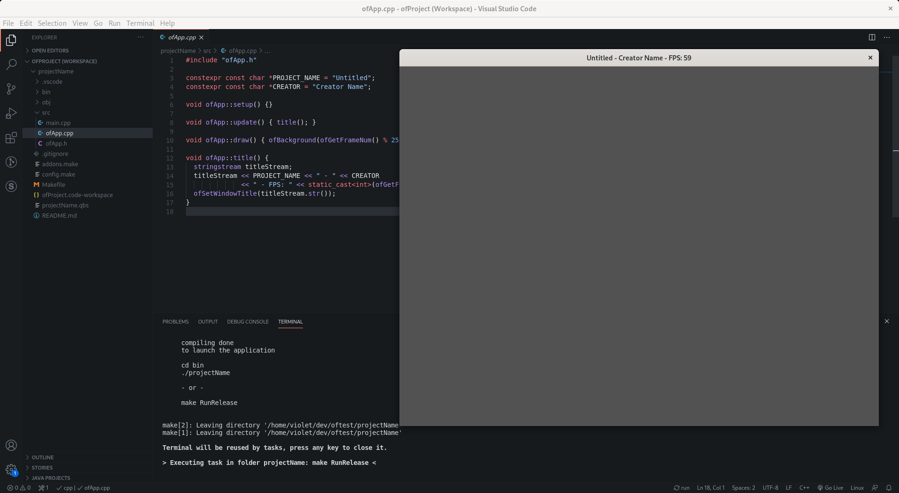

# 🌻 openFrameworks Templates 🌻

A collection of templates for openFrameworks' project generator. Designed to work primarily for [Visual Studio Code](https://code.visualstudio.com/) on Linux.

## About Templates

### oftBasic

A basic template for use in vscode on Linux. It includes auto formatting using clang-format and all necessary configuration to use intellisense in vscode.



### oftArduinoUno

Expands on the basic template to and creates a project that has a arduino sketch and a openFrameworks sketch that uses [ofx](). Configured for a hello world with an arduino uno using openFrameworks to communicate.


## Installation 🏗️

0. (optional) You may want to fork this repository and look through the templates and change the default name and folder path.

1. Add `export PG_OF_PATH=/path/to/openFrameworks` to `.profile` or `.bashrc` if you haven't already. *Doing this also means you can put the your project anywhere on your computer without worrying about projects being in the openFrameworks app directory, although if you every move a project to a different computer you may need to update the path.*

2. Install clang-format if not already installed. 

2. Define the following in Visual Studio Code settings (`Ctrl` + `,`). If using a more advanced template check below to see if there are other vscode settings needed.

>```json
>"openFrameworks.path": "/path/to/openFrameworks/", Must end with /
>```

3. Clone the repository, and run `install.sh`. *Please note this will duplicate the templates into `of/scripts/templates` so that they can be used but if you make any changes you'll have to replace the existing templates by running the install script again.*

## Usage ⚙️

1. Use Project Generator

>```bash
>projectGenerator -t"oftBasic" projectName
>projectGenerator -t"oftArduinoUno -a"ofxAddon" projectName
>```

2. Open the project in vscode. Click the `Open Workspace` button in the bottom right corner if you didn't open the workspace directly.

3. Accept recommended vscode extensions in the bottom right corner if the pop up comes up.

4. See the project's `README.md` for more information on running the project.

5. Make something awesome! 🎨

## Other VSCode Settings 💫

### For oftArduinoUno

```json
"arduino.path": "/path/to/arduino/", Must end with /
"arduino.commandPath": "arduino",
"arduino.defaultBaudRate": 9600,
```

## Contributing 💖

I'd be happy to accept templates that follow the same kind of structure. Also feel welcome to open an issue to discuss changes, possible features, and bugs.
